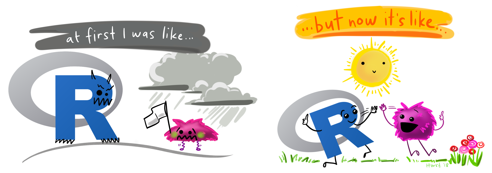
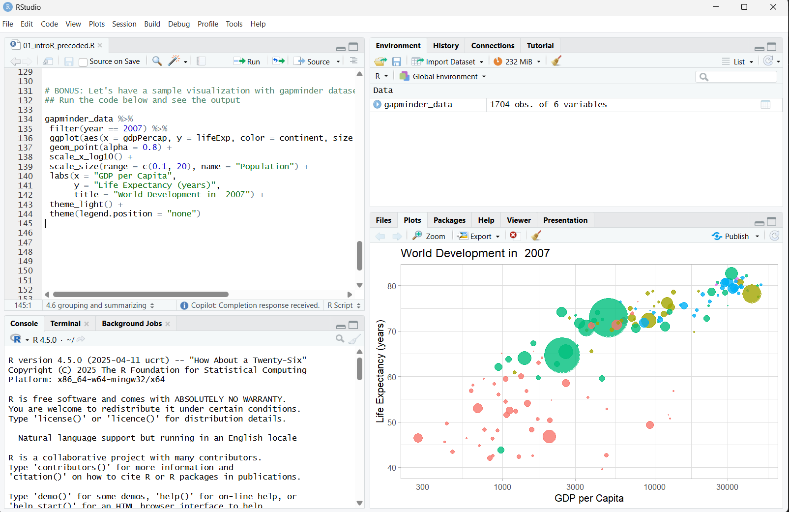
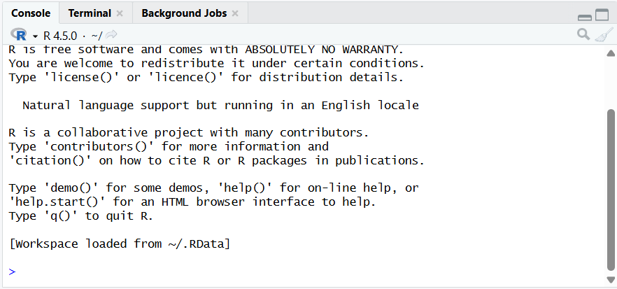
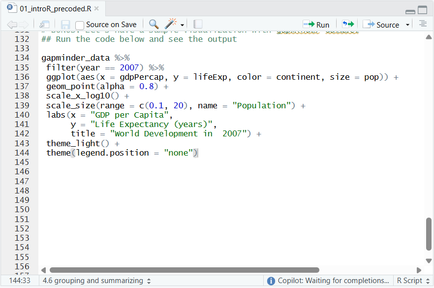
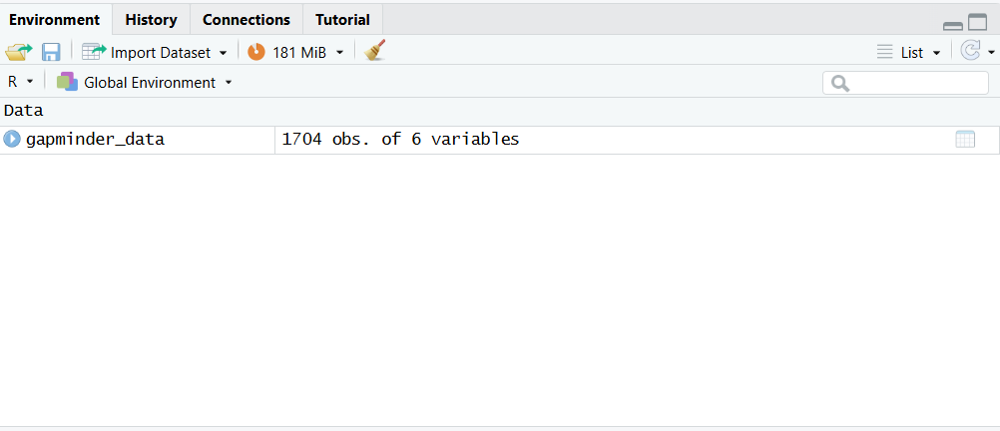
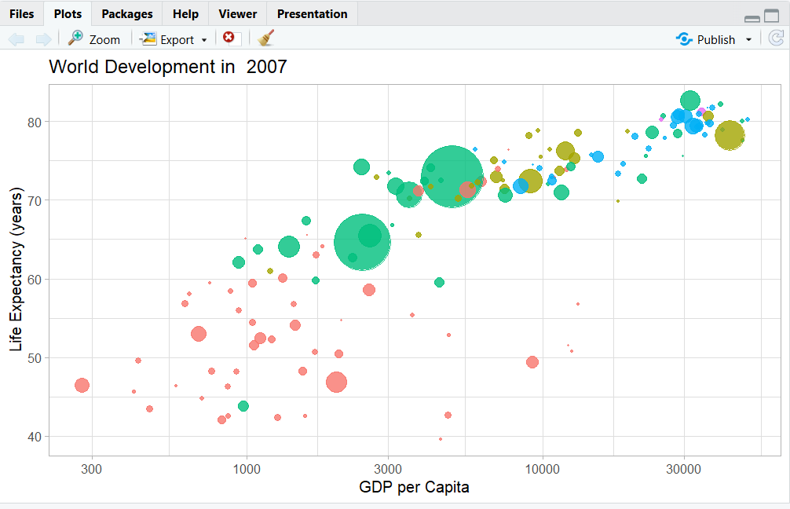

```{r}
#| echo: false
#| include: false

knitr::opts_chunk$set(comment = "", collapse = TRUE)

## working directory
setwd(here::here("s1-getting-started-r"))

## libraries
library(tidyverse)

```

## Overview

::: incremental
-   What is R?
-   Installing R and RStudio
-   R objects
-   Packages and help pages
-   Importing data
:::

# 

::: {style="font-size: 80%; text-align: center;"}
{width="90%" fig-align="center"}

Illustration adopted from [Allison Horst](https://twitter.com/allison_horst)
:::

# What is R?

## So ... what is R programming?

-   **R** is a language + an eco-system
    -   a free and open-source programming language
    -   statistical analysis, graphics representation, and reporting
    -   an eco-system of many high-quality user-contributed libraries/packages
    -   freely available under the GNU General Public License, and pre-compiled binary versions are provided for various operating systems (e.g., Linux, Windows, and Mac)

::: incremental
-   Before, R is known for its statistical analysis toolkits
-   Nowadays R is capable of many other tasks
    -   tools that facilitates the whole data analysis workflow
    -   tools for web technology
    -   even this presentation is made in R!
    -   also our class website is entirely built in R!
:::

## The History of R programming

<br>

::: {.box style="padding-bottom:56.25%; position:relative; display:block; width:100%"}
<iframe width="100%" height="100%" src="https://www.youtube.com/embed/iq_biXEIx-U?si=qq-ArfqGkbO9oYGm" frameborder="0" allowfullscreen style="position:absolute; top:0; left: 0">

</iframe>
:::

# Installing R and RStudio

## Installing R and RStudio on Windows

<br>

::: {.box style="padding-bottom:56.25%; position:relative; display:block; width:100%"}
<iframe width="100%" height="100%" src="https://www.youtube.com/embed/mxNrU902uyc?si=4ZpkkJWR0U4t9DRV" frameborder="0" allowfullscreen style="position:absolute; top:0; left: 0">

</iframe>
:::

## Installing R and RStudio on Mac/MacOS

<br>

::: {.box style="padding-bottom:56.25%; position:relative; display:block; width:100%"}
<iframe width="100%" height="100%" src="https://www.youtube.com/embed/I5WIMX4LK8M?si=KTR7GarK-JAB6Kej" frameborder="0" allowfullscreen style="position:absolute; top:0; left: 0">

</iframe>
:::

## RStudio interface

{height="90%" width="90%" fig-align="center"}

## RStudio interface: `Console window`

-   located in the bottom-left
-   where you often will find the output of your coding and computations

{fig-align="center"}

## RStudio interface: `Source window`

-   located in the top-left
-   *source* can be understood as any type of file, e.g. data, programming code, notes, etc.
-   edit script, text, markdown, website, others

{width="70%" height="70%" fig-align="center"}

## RStudio interface: `Environment/ History/ Connections/ Tutorials`

-   located in the top-right
-   **Environment:** shows saved R objects
-   **History:** computation you run in the console will be stored
-   **Connections:** allows the user to tab into external databases directly
-   **Tutorials:** additional materials to learn R and RStudio

{width="80%" height="80%" fig-align="center"}

## RStudio interface: `Files/ Plots/ Packages/ Help/ Viewer`

-   located in the bottom-right

{width="80%" height="80%" fig-align="center"}

# R objects and packages

## R Objects

::::: columns
::: {.column width="60%"}
-   You can consider R objects as **saving information**

-   e.g., text, number, matrix, vector, dataframe

-   In another words everything in R is an object
:::

::: {.column width="40%"}
{width="60%" fig-align="center"}
:::
:::::

## R objects

-   Objects in R are assigned a value using ←

:::::::::: columns
:::::: column
::: fragment
```{r}
#| echo: true
#| eval: false

a1 <- 10
a1
```

```{r}
a1 <- 10
a1
```
:::

<br>

::: fragment
```{r}
#| echo: true
#| eval: false

a2 <- 20
a2
```

```{r}
a2 <- 20
a2
```
:::

<br>

::: fragment
```{r}
#| echo: true
#| eval: false

a3 <- c(10, 20, 30)
a3
```

```{r}
a3 <- c(10, 20, 30)
a3
```
:::
::::::

::::: column
::: fragment
```{r}
#| echo: true
#| eval: false

a1 + a2
```

```{r}
a1 + a2
```
:::

<br>

::: fragment
```{r}
#| echo: true
#| eval: false

st_name <- "christopher"
st_age <- 23
st_sex <- "male"
student <- c(st_name, st_age, st_sex)

student
```

```{r}
st_name <- "christopher"
st_age <- 23
st_sex <- "male"
student <- c(st_name, st_age, st_sex)

student
```
:::
:::::
::::::::::

## R packages

::::: columns
::: column
-   Collection of functions that load into your working environment.

-   A package contains code that other R users have prepared for the community.

-   Installing a package

```{r}
#| eval: false
#| echo: true

install.packages("tidyverse")
```

-   Loading a package

```{r}
#| eval: false
#| echo: true

library(tidyverse)
```
:::

::: column
{width="80%" fig-align="center"}
:::
:::::

# Check-up quiz

## Which of the following is true about R packages? {.quiz-question}

-   [They are collections of functions prepared by the community.]{.correct data-explanation="Correct! R packages are collections of functions that have been prepared by the R community for general use."}
-   They are only available for Windows
-   They cannot be installed by users
-   They replace the base R functions entirely

## Which command is used to install an R package? {.quiz-question}

-   [install.packages()]{.correct data-explanation="Correct! The install.packages() function is used to install R packages."}
-   library()
-   require()
-   load()

## After installing a package, which command is used to load it into the R session? {.quiz-question}

-   install.packages()
-   [library()]{.correct data-explanation="Correct! The library() function is used to load an installed package into the current R session."}
-   require()
-   load()

## What symbol is used to assign a value to an object in R? {.quiz-question}

-   =
-   -\>
-   [\<-]{.correct data-explanation="Correct! The `<-` symbol is used to assign a value to an object in R."}
-   ==

## Which of the following statements about R is TRUE? {.quiz-question}

-   R is only available under paid license
-   R is freely available under GNU General Public License
-   R cannot be used for graphic representation
-   R is limited to Linux operating system

# Reading data into R

## Importing data

-   SPSS, Stata, SAS files: [haven package](https://haven.tidyverse.org/)

-   Excel files: [readxl package](https://readxl.tidyverse.org/)

-   CSV files: [readr package](https://readr.tidyverse.org/)

## Importing data into R

#### SPSS, Stata & SAS using [haven package](https://haven.tidyverse.org/)

::::: columns
::: column
```{r}
#| echo: true
#| eval: false

# loading haven package
library(haven)
```

<br>

```{r}
#| echo: true
#| eval: false

# SPSS
read_sav("path/data.sav")
```

<br>

```{r}
#| echo: true
#| eval: false

# Stata
read_dta("path/data.dta")
```

<br>

```{r}
#| echo: true
#| eval: false

# SAS
read_sas("path/data.sas7bdat")
```
:::

::: column
```{r}
#| echo: false
#| fig-align: center
#| out-width: "40%"


```
:::
:::::

## Importing data into R

#### Excel files using [readxl package](https://readxl.tidyverse.org/)

<br>

::::: columns
::: {.column width="70%"}
```{r}
#| echo: true
#| eval: false
library(readxl)
read_excel("path/dataset.xls")
```

```{r}
#| echo: false
#| results: hold 

dataset_xl_sample <- readxl::readxl_example("datasets.xlsx")
readxl::read_excel(dataset_xl_sample)
```
:::

::: {.column width="30%"}
```{r}
#| echo: false
#| fig-align: center
#| out-width: "40%"


```
:::
:::::

## Importing data into R

#### CSV files using [readr package](https://readr.tidyverse.org/)

<br>

::::: columns
::: {.column width="60%"}
```{r}
#| echo: true
#| eval: false

install.packages("readr")
library(readr)
```

<br>

```{r}
#| echo: true
#| eval: false

# comma separated (CSV) files
read_csv("path/data.csv")
```

<br>

```{r eval=FALSE}
#| echo: true
#| eval: false

# tab separated files
read_tsv("path/data.tsv")
```

<br>

```{r eval=FALSE}
#| echo: true
#| eval: false

# general delimited files
read_delim("path/data.delim")
```
:::

::: {.column width="40%"}
```{r}
#| echo: false
#| fig-align: center
#| out-width: "40%"


```
:::
:::::

# Check-up quiz

## Which R package is used to import SPSS, Stata, and SAS files? {.quiz-question}

-   readr\
-   [haven]{.correct data-explanation="Correct! The haven package is designed to import data from SPSS (.sav), Stata (.dta), and SAS (.sas7bdat) files."}\
-   readxl\
-   tidyr

## If you want to import Excel files into R, which function should you use? {.quiz-question}

-   read_csv()\
-   [read_excel()]{.correct data-explanation="Correct! The readxl package provides the read_excel() function to import .xls or .xlsx files."}\
-   read_sav()\
-   read_tsv()

## Which function from the readr package is used to import comma‑separated values (CSV) files? {.quiz-question}

-   [read_csv()]{.correct data-explanation="Correct! The readr package includes read_csv() for CSV files, read_tsv() for tab‑separated files, and read_delim() for general delimited files."}\
-   read_delim()\
-   read_tsv()\
-   read_excel()

## Which of the following statements about importing data into R is TRUE? {.quiz-question}

-   read_sav() is used for Excel files
-   [read_tsv() is used for tab‑separated files]{.correct data-explanation="Correct! The readr package provides read_tsv() specifically for tab‑separated files."}
-   read_excel() is part of the readr package
-   read_dta() is used for CSV files

## Which package would you use if you need to import a dataset saved in Stata format (.dta)? {.quiz-question}

-   readxl\
-   readr\
-   [haven]{.correct data-explanation="Correct! The haven package supports importing Stata files using the read_dta() function."}\
-   tidyr

# Let's practice!