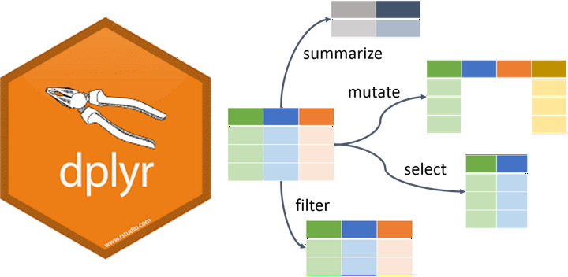
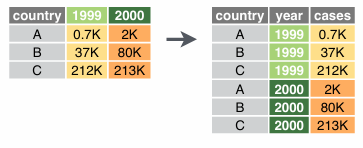
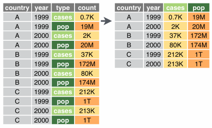

```{r}
#| echo: false
#| include: false

knitr::opts_chunk$set(comment = "", collapse = TRUE, echo = TRUE)

## working directory
setwd(here::here("s2-data-wrangling"))

## libraries
library(tidyverse)
library(readxl)

```

## Overview

::: incremental
-   Introduction to Tidyverse
-   Basic data wrangling with `dplyr`
-   Data reshaping
:::

# Basic data wrangling with `dplyr`

## Data wrangling using `dplyr` {.center-text}

<center></center>

::: {style="font-size:70%; text-align:center;"}
Illustration adopted from [Allison Horst](https://github.com/allisonhorst)
:::

## `dplyr`

:::::: columns
:::: column
**Overview**

-   `select()` picks variables based on their names

-   `mutate()` adds new variables

-   `filter()` picks cases based on their values

-   `summarise()` reduces multiple values down to a single summary

-   `arrange()` change the ordering of the rows

::: aside
see `dplyr` [cheatsheets](https://github.com/rstudio/cheatsheets/blob/cd775237fd6de08df51e69941fe01967ecd9bdc2/data-transformation.pdf)
:::
::::

::: column
{fig-align="center"}
:::
::::::

## `select()`

::::: columns
::: {.column width="50%"}
```{r}
#| echo: false
data <- gapminder::gapminder
```

```{{r}}
data
```

<br>

```{r}
#| class-output: "remark-code"
#| echo: true

data
```
:::

::: {.column width="50%"}
```{{r}}
select(data, continent, country, pop)
```

<br>

```{r}
#| echo: true
#| class-output: "remark-code"
select(data, continent, country, pop)
```
:::
:::::

## `select()`

We can also **remove** variables with a **`-`** (minus)

::::: columns
::: column
```{r echo=FALSE}
data <- gapminder::gapminder
```

```{{r}}
data
```

<br>

```{r}
#| echo: true
#| class-output: "remark-code"

data
```
:::

::: column
```{{r}}
select(data, -year, -pop)
```

<br>

```{r}
#| echo: true
#| class-output: "remark-code"

select(data, -year, -pop)
```
:::
:::::

## `select()`

**Selection helpers**

These *selection helpers* match variables according to a given pattern.

-   `starts_with()` starts with a prefix

-   `ends_with()` ends with a suffix

-   `contains()` contains a literal string

-   `matches()` matches regular expression

## `filter()`

::::: columns
::: {.column width="50%"}
```{{r}}
data
```

<br>

```{r}
#| echo: true
#| class-output: "remark-code"

data
```
:::

::: {.column width="50%"}
```{{r}}
filter(data, country == "Philippines")
```

<br>

```{r}
#| echo: true
#| class-output: "remark-code"

filter(data, country == "Philippines")
```
:::
:::::

## `mutate()`

The `mutate` function will take a statement similar to this:

-   `variable_name` = `do_some_calculation`

-   `variable_name` will be attached at the end of the dataset.

## `mutate()`

Let's calculate the `gdp`

::::: columns
::: column
```{{r}}
data
```

<br>

```{r}
#| echo: true
#| class-output: "remark-code"

data
```
:::

::: column
```{{r}}
mutate(data, GDP = gdpPercap * pop)
```

<br>

```{r}
#| echo: true
#| class-output: "remark-code"

mutate(data, GDP = gdpPercap * pop)
```
:::
:::::

## `rename()`

Changes the variable name while keeping all else intact.

-   `new_variable_name` = `old_variable_name`

::::: columns
::: column
```{{r}}
data
```

<br>

```{r}
#| echo: true
#| class-output: "remark-code"

data
```
:::

::: column
```{{r}}
rename(data, population = pop)
```

<br>

```{r}
#| echo: true
#| class-output: "remark-code"
rename(data, population = pop)
```
:::
:::::

## `arrange()`

You can order data by variable to show the highest or lowest values first.

::::: columns
::: column
consider `lifeExp` default is lowest first

```{{r}}
data
```

<br>

```{r}
#| echo: true
#| class-output: "remark-code"
data
```
:::

::: column
`desc()` sort `lifeExp` from highest to lowest

```{{r}}
arrange(data, desc(lifeExp))
```

<br>

```{r}
#| echo: true
#| class-output: "remark-code"

arrange(data, desc(lifeExp))
```
:::
:::::

## `group_by` and `summarise()`

-   Use when you want to aggregate your data (by groups).

-   Sometimes we want to calculate group statistics.

<br>

::: {style="fig.align="center";"}

:::

## `group_by` and `summarise()`

Suppose we want to know the average population by continent.

::::: columns
::: column
```{{r}}
data
```

<br>

```{r}
#| echo: true
#| class-output: "remark-code"

data
```
:::

::: column
```{{r}}
grouped_by_continent <- group_by(data, continent)
summarise(grouped_by_continent, avg_pop = mean(pop))
```

<br>

```{r}
#| echo: true
#| class-output: "remark-code"

grouped_by_continent <- group_by(data, continent)
summarise(grouped_by_continent, avg_pop = mean(pop))
```
:::
:::::

## `group_by` and `summarise()`

Suppose we want to know the average population by continent.

::::: columns
::: column
```{{r}}
data
```

<br>

```{r}
#| echo: true
#| class-output: "remark-code"

data
```
:::

::: column
```{{r}}
grouped_by_continent <- group_by(data, continent)
summarised_data <- summarise(grouped_by_continent, avg_pop = mean(pop))
arrange(summarised_data, desc(avg_pop))
```

<br>

```{r}
#| echo: true
#| class-output: "remark-code"

grouped_by_continent <- group_by(data, continent)
summarised_data <- summarise(grouped_by_continent, avg_pop = mean(pop))
arrange(summarised_data, desc(avg_pop))
```
:::
:::::

##  {transition="fade" auto-animate="true"}

::::: columns
::: column
### Too many codes!

### It's hard to follow!

### It's hard to keep track of the codes!
:::

::: column

:::
:::::

##  {transition="fade" auto-animate="true"}

<center></center>

### `%>%` or `|>`pipe operator {.center-text}

## The `%>%` and `|>` operator

The **`%>%`** or **`|>`** helps your write code in a way that is easier to read and understand.

::::: columns
::: column
```{{r}}
grouped_by_continent <- group_by(data, continent)
summarised_data <- summarise(grouped_by_continent, avg_pop = mean(pop))
arrange(summarised_data, desc(avg_pop))
```

<br>

```{r}
#| echo: true
#| class-output: "remark-code"

grouped_by_continent <- group_by(data, continent)
summarised_data <- summarise(grouped_by_continent, avg_pop = mean(pop))
arrange(summarised_data, desc(avg_pop))
```
:::

::: column
```{{r}}
data %>% 
  group_by(continent) %>% 
  summarise(avg_pop = mean(pop)) %>% 
  arrange(desc(avg_pop))
```

<br>

```{r}
#| echo: true
#| class-output: "remark-code"

data %>% 
  group_by(continent) %>% 
  summarise(avg_pop = mean(pop)) %>% 
  arrange(desc(avg_pop))
```
:::
:::::

## The`%>%`operator

What is the average life expectancy of Asian countries per year?

::::: columns
::: column
```{{r}}
filtered_by_asia <- filter(data, continent == "Asia")
grouped_by_country_year <- group_by(filtered_by_asia, country, year)
summarise(grouped_by_country_year, avg_lifeExp = mean(lifeExp))
```

<br>

```{r}
#| echo: true
#| class-output: "remark-code"

filtered_by_asia <- filter(data, continent == "Asia")
grouped_by_country_year <- group_by(filtered_by_asia, country, year)
summarise(grouped_by_country_year, avg_lifeExp = mean(lifeExp))
```
:::

::: column
```{{r}}
data %>% 
  filter(continent == "Asia") %>% 
  group_by(country, year) %>% 
  summarise(avg_lifeExp = mean(lifeExp))
```

<br>

```{r}
#| echo: true
#| class-output: "remark-code"

data %>% 
  filter(continent == "Asia") %>% 
  group_by(country, year) %>% 
  summarise(avg_lifeExp = mean(lifeExp))
```
:::
:::::

## The `%>%` operator

<br>

::::: columns
::: column
```{{r}}
filtered_by_asia <- filter(data, continent == "Asia")
grouped_by_country <- group_by(filtered_by_asia, country)
summarised_by_country <- summarise(grouped_by_country, avg_lifeExp = mean(lifeExp))
arrange(summarised_by_country, desc(avg_lifeExp))
```

<br>

```{r}
#| echo: true
#| class-output: "remark-code"

filtered_by_asia <- filter(data, continent == "Asia")
grouped_by_country <- group_by(filtered_by_asia, country)
summarised_by_country <- summarise(grouped_by_country, avg_lifeExp = mean(lifeExp))
arrange(summarised_by_country, desc(avg_lifeExp))
```
:::

::: column
```{{r}}
data %>% 
  filter(continent == "Asia") %>% 
  group_by(country) %>% 
  summarise(avg_lifeExp = mean(lifeExp)) %>% 
  arrange(desc(avg_lifeExp))
```

<br>

```{r}
#| echo: true
#| class-output: "remark-code"
data %>% 
  filter(continent == "Asia") %>% 
  group_by(country) %>% 
  summarise(avg_lifeExp = mean(lifeExp)) %>% 
  arrange(desc(avg_lifeExp))
```
:::
:::::

# Check-up quiz

## Which dplyr function is used to select specific columns from a dataset? {.quiz-question}

-   filter()\
-   mutate()\
-   [select()]{.correct data-explanation="Correct! The select() function picks variables (columns) based on their names."}\
-   summarise()

## Which dplyr function is used to add new variables to a dataset? {.quiz-question}

-   arrange()\
-   [mutate()]{.correct data-explanation="Correct! The mutate() function creates new variables by applying calculations or transformations, attaching them at the end of the dataset."}\
-   summarise()\
-   filter()

## If you want to keep only rows where country == "Philippines", which function should you use? {.quiz-question}

-   select()\
-   [filter()]{.correct data-explanation="Correct! The filter() function selects cases (rows) based on their values, such as keeping only rows where country == \"Philippines\"."}\
-   arrange()\
-   mutate()

## Which dplyr function reduces multiple values down to a single summary statistic (e.g., mean, sum)? {.quiz-question}

-   mutate()\
-   [summarise()]{.correct data-explanation="Correct! The summarise() function collapses multiple values into a single summary, such as calculating averages or totals."}\
-   arrange()\
-   select()

## Which dplyr function is used to reorder rows in a dataset? {.quiz-question}

-   [arrange()]{.correct data-explanation="Correct! The arrange() function changes the ordering of rows based on specified variables."}\
-   mutate()\
-   filter()\
-   select()

# Basic data transformation

## Reshaping data

-   the process of changing the structure or layout of a dataset without altering its actual content.

-   it helps organize data into formats that are easier to analyze, visualize, or model.

-   same information, different arrangement.

<br>

::::: columns
::: column
**wide formt → long format** 
:::

::: column
**long format → wide format** 
:::
:::::

<!-- end columns -->

## Reshaping data

-   `tidyr` package provides powerful functions for reshaping:
    -   `pivot_longer()` → converts wide data into long format.
    -   `pivot_wider()` → converts long data into wide format.

<br>

::::: columns
::: column
**wide formt → long format** 
:::

::: column
**long format → wide format** 
:::
:::::

<!-- end columns -->

## Wide data format

-   each subject or observation occupies a single row, with multiple variables spread across columns.

-   one row per entity, many columns for repeated measures.

-   easier for human readability and simple summaries. Often used in spreadsheets.

```{r}
#| echo: fenced
read_excel("data/urbanpop.xlsx")
```

## Long data format

-   each measurement or observation is stored in its own row, with variables indicating who, what, and when.

-   multiple rows per entity, fewer columns.

-   referred for statistical modeling, visualization (e.g., `ggplot2` in R), and tidy data principles.

```{r}
#| echo: fenced
read_excel("data/urbanpop.xlsx") |> 
  pivot_longer(cols = `1960`:`1966`, names_to = "year", values_to = "urban_pop")
```

## Wide → Long data format

-   `pivot_longer()` function "lengthens" data by collapsing several coumns into two
-   original column names → names
-   data values → value

```{r}
#| echo: fenced
#| eval: false

pivot_longer(data, cols, names_to = "name", values_to = "value")
```


## Wide → Long data format

-   `pivot_longer()` function "lengthens" data by collapsing several coumns into two
-   original column names → names
-   data values → value

::::: columns
::: column
```{r}
#| echo: true
#| class-output: "remark-code"
read_excel("data/urbanpop.xlsx")
```
:::

::: column
```{r}
#| echo: true
#| class-output: "remark-code"
read_excel("data/urbanpop.xlsx") |> 
  pivot_longer(cols = `1960`:`1966`, names_to = "year", values_to = "urban_pop")
```
:::
:::::

<!-- end columns -->

## Long → Wide data format

-   inverse of `pivot_longer()`, widening data by expanding two columns into many

-   used when a dataset is "too long" - an observation is scattered across multiple rows

```{r}
#| echo: fenced
#| eval: false
pivot_wider(data, names_from = "name", values_to = "cases")
```


## Long → Wide data format

-   inverse of `pivot_longer()`, widening data by expanding two columns into many

-   used when a dataset is "too long" - an observation is scattered across multiple rows

```{r}
#| echo: false
urban_pop_long <- 
  read_excel("data/urbanpop.xlsx") |> 
  pivot_longer(cols = `1960`:`1966`, names_to = "year", values_to = "urban_pop") 
```

::::: columns
::: column
```{r}
#| echo: true
#| class-output: "remark-code"

urban_pop_long
```
:::

::: column
```{r}
#| echo: true
#| class-output: "remark-code"
urban_pop_long |> 
  pivot_wider(names_from = year, values_from = urban_pop)
```
:::
:::::

<!-- end columns -->

# Thank you!