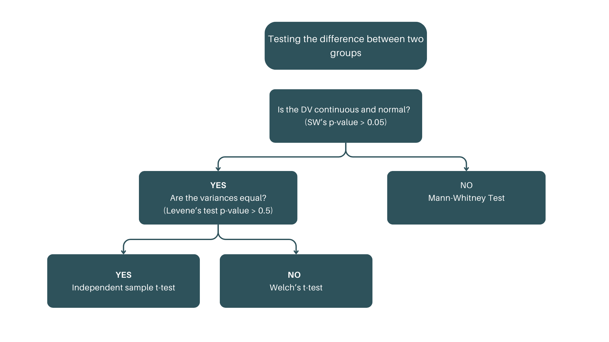

```{r}
#| echo: false
#| include: false

knitr::opts_chunk$set(comment = "", collapse = TRUE)

## working directory
setwd(here::here("s4-statistical-analysis"))

## libraries
pacman::p_load(knitr, tidyverse)

## theme
theme_set(theme_minimal()) +
  theme(axis.title = element_text(size = 14))

```

## Outline

- Introduction to hypothesis testing
- Parametric vs non-parametric tests
- Independent sample t-test
- Paired sample t-test
- One-way ANOVA
- Two-way ANOVA
- Chi-square test of independence

# Lesson 1: Introduction to hypothesis testing?

## What is hypothesis testing?

-   Hypothesis testing is a statistical method used to make inferences or draw conclusions about a population based on sample data.

-   It involves evaluating two competing hypotheses to determine if there is enough evidence to support a particular claim.

## Key Concepts in Hypothesis Testing

::::: columns
::: column
### **Null Hypothesis (H₀)**

-   A statement suggesting no effect, no difference, or no relationship exists. This is the hypothesis that is tested.
-   Example: "There is no difference in the average test scores between two groups."
:::

::: column
### **Alternative Hypothesis (H₁ or Ha)**

-   A statement that contradicts the null hypothesis, proposing that there is a significant effect or difference.
-   Example: "There is a significant difference in the average test scores between two groups."
:::
:::::

## Steps in Hypothesis Testing

::: incremental
1.  **State the hypotheses**: Define H₀ and H₁.

2.  **Choose a significance level (α)**: Common choices are 0.05 or 0.01. This determines the threshold for rejecting H₀.

3.  **Select the appropriate test**: Based on the data type and hypotheses (e.g., t-test, ANOVA).

4.  **Compute the test statistic**: This involves calculating a value that measures the difference between the sample data and the null hypothesis.

5.  **Make a decision**:

-   

    -   Reject H₀ if the test statistic shows significant evidence against H₀ (i.e., p-value \< α).
    -   Fail to reject H₀ if there is not enough evidence (i.e., p-value ≥ α).
:::

## Types of Errors

:::::: columns
::::: incremental
::: {.column width="50%"}
**Type I Error (False Positive)**

-   

    -   Rejecting H₀ when it is actually true.
    -   Example: Concluding there is a difference when there isn’t.
:::

::: {.column width="50%"}
**Type II Error (False Negative)**

-   

    -   Failing to reject H₀ when it is false.
    -   Example: Concluding there is no difference when there actually is.
:::
:::::
::::::

## Test Statistic and P-Value

-   

    -   The test statistic is a value calculated from the sample data used to decide whether to reject the null hypothesis.

    -   The p-value is the probability of obtaining a result at least as extreme as the one observed, given that H₀ is true.

        -   If p-value \< α, reject H₀; otherwise, fail to reject H₀.

# Check-up quiz!

## What is the purpose of hypothesis testing? {.quiz-question}

-   To prove a hypothesis is true.

-   [To make inferences about a population based on sample data]{.correct}

-   To collect sample data.

-   To test the validity of a hypothesis in all situations.

## Which of the following is the null hypothesis (H₀)? {.quiz-question}

-   There is a significant difference between the two groups.

-   [There is no effect or no difference between the two groups]{.correct}

-   The sample data is unreliable.

-   The alternative hypothesis is true.

## What does the p-value represent in hypothesis testing? {.quiz-question}

-   The probability that the null hypothesis is true.

-   [The probability of observing a test statistic as extreme as the one calculated, assuming the null hypothesis is true]{.correct}

-   The critical value required to reject the null hypothesis.

-   The likelihood of making a Type II error.

## Which of the following is a Type I error? {.quiz-question}

-   Concluding there is no effect when one exists.

-   Concluding there is an effect when none exists.

-   [Rejecting the null hypothesis when it is true]{.correct}

-   Accepting the null hypothesis when it is false.

## What is the significance level (α) typically set at in hypothesis testing? {.quiz-question}

-   0.10

-   0.01

-   [0.05]{.correct}

-   0.50

# Lesson 2: Parametric vs Non-parametric tests

## Parametric and non-parametric tests

| Parametric                | Non-parametric            |
|---------------------------|---------------------------|
| Independent sample t-test | Mann-Whitney U test       |
| Paired samples t-test     | Wilcoxon signed rank test |
| One-way ANOVA             | Kruskal-Wallis test       |
|                           | Chi-squared tests         |

## Statistical tests for comparing two groups

<br>

+-------------------------------------------------------------------------------------------------------------------------------------+----------------------------------------------------------------------+----------------------------------------------------------------------------------------------------------------+
| Purpose                                                                                                                             | Data types                                                           | Usage                                                                                                          |
+=====================================================================================================================================+======================================================================+================================================================================================================+
| -   To determine if there is a significant differences between two groups in a dataset, either in means, medians, or distributions. | -   Continuous data (e.g., height, test scores, income)              | -   Comparing average performance between two independent groups (e.g., test scores of two classes)            |
|                                                                                                                                     | -   Ordinal data (e.g., satisfaction rating, ranks)                  | -   Comparing means when groups have unequal variances (e.g., salaries across department)                      |
|                                                                                                                                     | -   Assumptions about data (normality, equal variances) vary by test | -   Comparing medians of two groups when data isn’t normally distributed (e.g., customer satisfaction scores). |
+-------------------------------------------------------------------------------------------------------------------------------------+----------------------------------------------------------------------+----------------------------------------------------------------------------------------------------------------+

## Independent samples t-test

+----------------------------------------------------------+----------------------------------------------------------------------------+------------------------------------------------------------------------------------------------------+
| Purpose                                                  | Data requirements                                                          | Example                                                                                              |
+==========================================================+============================================================================+======================================================================================================+
| -   Comparing means of two independent/unrelated groups. | -   Two variables                                                          | -   Comparing average performance between two independent groups (e.g., test scores of two classes). |
|                                                          |                                                                            |                                                                                                      |
|                                                          |     -   1 continuous variable and 1 categorical/discrete with 2 categories |                                                                                                      |
|                                                          |                                                                            |                                                                                                      |
|                                                          | -   Normality                                                              |                                                                                                      |
|                                                          |                                                                            |                                                                                                      |
|                                                          |     -   use Shapiro Wilk's test (p-value \> 0.05                           |                                                                                                      |
|                                                          |                                                                            |                                                                                                      |
|                                                          | -   Homogeneity of variance                                                |                                                                                                      |
|                                                          |                                                                            |                                                                                                      |
|                                                          |     -   use Levene's tests (p-value\>0.05)                                 |                                                                                                      |
+----------------------------------------------------------+----------------------------------------------------------------------------+------------------------------------------------------------------------------------------------------+

## Independent sample t-test

```{r}

```

## Independent sample t-test

::: {.callout-tip style="font-size: 2.0em;"}
## Steps in Hypothesis testing

1.  State the hypotheses

2.  Specify the decision rule and the level of\
    statistical significance.

3.  Test the assumptions and Identify the appropriate test.

4.  Compute for the statistic and p-value

5.  Decision: Compare p-value and alpha value.

6.  Conclusion
:::

## Independent sample t-test

::: {.callout-tip style="font-size: 2.0em;"}
## Activitiy: Comparison two independent group

Using the **mpg** dataset, test whether there is a statistically significant difference in the hwy miles per gallon (hwy) between 4-cylinder and 8-cylinder automobiles.
:::

## Independent sample t-test

::::: columns
::: {.column width="50%"}
Step 1: Import data and data management

```{r}
#| echo: true

## setting cyl variable as factor
mpg_dta <- 
  mpg |> 
  filter(cyl %in% c(4, 8)) |> 
  mutate(cyl = as_factor(cyl))

head(mpg_dta)
```
:::

::: {.column width="50%"}
Step 2: Test of normality

```{r}
#| echo: true

mpg_dta |>
  group_by(cyl) |>
  summarise(
    shapiro_test = shapiro.test(hwy)$statistic,
    p_value = shapiro.test(hwy)$p.value
  )
```
:::
:::::

## Independent sample t-test

::::: columns
::: {.column width="50%"}
Step 3: Test of homogeneity of variance

```{r}
#| echo: true
car::leveneTest(data = mpg_dta, hwy ~ cyl, center = mean)
car::leveneTest(data = mpg_dta, hwy ~ cyl, center = median)
```
:::

::: {.column width="50%"}
Step 4: Perform independent sample t-test

```{r}
#| echo: true

t.test(hwy ~ cyl, data = mpg_dta, var.equal = FALSE, na.rm = TRUE)
```
:::
:::::

## Independent sample t-test

::: {.callout-tip style="font-size: 2.0em;"}
## Solution

1.  State the Null and Alternative Hypotheses

-   Ho: There is no significant difference in the average miles per gallon between 4-cylinder and 8-cylinder automobiles.

-   Ha: There is a significant difference in the average miles per gallon between 4-cylinder and 8-cylinder automobiles.

2.  Specify the level of statistical significance (α)

-   α: 0.05
:::

## Independent sample t-test

::: {.callout-tip style="font-size: 2.0em;"}
## Solution

3.  Test Assumptions

-   Normality: failed to satisfy

-   Homogeneity of variance: failed to Satisfy

-   Test to be used: Welch's t-test

4.  Run the test in R, get the statistic and p-value

-   T Statistic: 17.58

-   p-value: 0.000
:::

## Independent sample t-test

::: {.callout-tip style="font-size: 2.0em;"}
## Solution

5.  Decision

-   Since the p-value (0.000) is less than alpha (0.05), reject Ho.

6.  Conclusion

-   There is a significant difference in the average miles per gallon between 4-cylinder and 8-cylinder automobiles.
:::

## Independent sample t-test

::::: columns
::: {.column width="30%"}
```{r}
#| echo: true
#| eval: false

library(ggstatsplot)

ggbetweenstats(
  data = mpg_dta,
  x = cyl,
  y = hwy,
  messages = FALSE
)

```
:::

::: {.column width="70%"}
```{r}
#| echo: false
#| fig-width: 10
#| fig-height: 8

library(ggstatsplot)

ggbetweenstats(
  data = mpg_dta,
  x = cyl,
  y = hwy,
  messages = FALSE
) +
  theme_minimal(base_size = 18) +
  theme(legend.position = "none")

```
:::
:::::

## Mann-Whitney U test

```{r}
#| echo: true
wilcox.test(hwy ~ cyl, data = mpg_dta, exact = FALSE)
```

## R Activity: Mann-Whitney U test

::: {.callout-tip style="font-size: 2.0em;"}
## Instructions

1.  Load the diamonds dataset from the `ggplot2` package. Filter the data to include only "Very Good" and "Premium" cut diamonds. Sample 1000 observations from each group to ensure the Shapiro-Wilk test can be applied.

2.  Checking Assumptions: Normality and Homogeneity of Variance

3.  Conduct the Mann-Whitney U test to compare the median prices of the two groups.

4.  Interpret the result
:::

```{r}
#| echo: false
#| eval: false

## answer key to the exercises
diamond_dataset <- 
  ggplot2::diamonds |> 
  filter(cut %in% c("Very Good", "Premium")) |> 
  mutate(cut = as_factor(cut)) |> 
  mutate(price = as.numeric(price)) |> 
  group_by(cut) |> 
  sample_n(1000) |> 
  ungroup()

## normality test
diamond_dataset |>
  group_by(cut) |>
  summarise(
    shapiro_test = shapiro.test(price)$statistic,
    p_value = shapiro.test(price)$p.value
  )

## homogeneity of variance
car::leveneTest(data = diamond_dataset, price ~ cut, center = mean)

## mann-whitney u test
wilcox.test(price ~ cut, data = diamond_dataset, exact = FALSE)
```

# Check up quiz

## Which of the following is a key assumption of the independent t-test? {.quiz-question}

-   Normality of the dependent variable in both groups

-   Equal variances between the two groups

-   Independence of observations within each group

-   [All of the above]{.correct}

## When would you choose to use the Mann-Whitney U-test instead of an independent t-test? {.quiz-question}

-   When the sample sizes are small

-   When the data is normally distributed

-   When the variances of the two groups are equal

-   [When the data is not normally distributed]{.correct}

## Which of the following is a non-parametric test? {.quiz-question}

-   Independent t-test

-   One-way ANOVA

-   [Mann-Whitney U-test]{.correct}

-   Pearson correlation

## If the p-value of a Mann-Whitney U-test is less than 0.05, what conclusion can we draw? {.quiz-question}

-   There is no significant difference between the two groups

-   [There is a significant difference between the two groups]{.correct}

-   The test is inconclusive

-   The assumptions of the test are not met

## Dependent t-test

-   Used to compare the means of two related groups.

-   Example: Comparing test scores before and after a training program.

-   Assumptions: Normality, homogeneity of variance, and dependent observations.

## Dependent t-test

::: {.callout-tip style="font-size: 2.0em;"}
-   Steps in hypothesis testing:

    1.  State the hypotheses.

    2.  Specify the level of statistical significance (α).

    3.  Test assumptions and identify the appropriate test.

    4.  Compute the statistic and p-value.

    5.  Decision: Compare p-value and alpha value.

    6.  Conclusion.
:::

## Dependent t-test

::: {.callout-tip style="font-size: 2.0em;"}
## Activity: Dependent t-test

Using the a synthetic data on training scores of before and after a training program, test whether there is a statistically significant difference in the scores before and after the training program.
:::

## Dependent t-test

::::: columns
::: {.column width="50%"}
Step 1: Import data and data management

```{r}
#| echo: true
## using a synthetic dataset
before <- c(12.2, 14.6, 13.4, 11.2, 12.7, 10.4, 15.8, 13.9, 9.5, 14.2)
after <- c(13.5, 15.2, 13.6, 12.8, 13.7, 11.3, 16.5, 13.4, 8.7, 14.6)

training_data <- tibble(subject = rep(c(1:10), 2), 
                   time = rep(c("before", "after"), each = 10),
                   score = c(before, after)) |> 
  mutate(time = as_factor(time))

head(training_data)
```
:::

::: {.column width="50%"}
Step 2: Test of normality

```{r}
#| echo: true
training_data |>
  group_by(time) |>
  summarise(
    shapiro_test = shapiro.test(score)$statistic,
    p_value = shapiro.test(score)$p.value
  )
```
:::
:::::

## Dependent t-test

::::: columns
::: {.column width="50%"}
Step 3: Test of homogeneity of variance

```{r}
#| echo: true

car::leveneTest(data = training_data, score ~ time, center = mean)
```
:::

::: {.column width="50%"}
Step 4: Perform dependent sample t-test

```{r}
#| echo: true

t.test(training_data$score[training_data$time=="before"], 
       training_data$score[training_data$time=="after"], paired = TRUE, na.rm = TRUE)
```
:::
:::::

## Dependent t-test

::::: columns
::: {.column width="30%"}
```{r}
#| echo: true
#| eval: false

## plot paired sample t test using ggbetweenstats
ggwithinstats(
  data = training_data,
  x = time,
  y = score,
  title = "Paired Samples T-Test",
)
```
:::

::: {.column width="70%"}
```{r}
#| echo: false
#| fig-width: 10
#| fig-height: 8

## plot paired sample t test using ggbetweenstats
ggwithinstats(
  data = training_data,
  x = time,
  y = score,
  title = "Paired Samples T-Test",
) +
  theme_minimal(base_size = 18) +
  theme(legend.position = "none")

```
:::
:::::

# Check-up quiz

## Which of the following scenarios is appropriate for a paired samples t-test? {.quiz-question}

-   Comparing the test scores of two independent groups.

-   [Measuring the effectiveness of a training program by comparing pre and post test scores of the same individuals]{.correct}

-   Comparing the heights of men and women in a population.

-   Testing the correlation between two variables.

## What is the null hypothesis in a paired samples t-test? {.quiz-question}

-   The means of the two groups are equal.

-   The means of the paired measurements are equal.

-   [The paired differences have a mean of zero]{.correct}

-   There is no relationship between the two variables.

## In the context of a paired t-test, which of the following R functions is used to perform the test? {.quiz-question}

-   `lm()`

-   [`t.test()`]{.correct}

-   `aov()`

-   `cor.test()`

# Statistical tests for comparing more than two groups

## comparing more than two groups

<br>

+--------------------------------------------------------------------------------------------------------------------------------------------+----------------------------------------------------------------------+-------------------------------------------------------------------------------------------------------------------------------------------------------------------+
| Purpose                                                                                                                                    | Data requirements                                                    | Example                                                                                                                                                           |
+============================================================================================================================================+======================================================================+===================================================================================================================================================================+
| -   To determine whether there are significant differences among the means, medians, or distribution of three or more groups in a dataset. | -   continuous data (e.g., height, test scores, income)              | -   Testing if the means of multiple independent groups are significantly different (e.g., "Are the average incomes of employees in three companies different?"). |
|                                                                                                                                            | -   Ordinal data (e.g., satisfaction ratings, ranks).                |                                                                                                                                                                   |
|                                                                                                                                            | -   Assumptions about data (normality, equal variances) vary by test |                                                                                                                                                                   |
+--------------------------------------------------------------------------------------------------------------------------------------------+----------------------------------------------------------------------+-------------------------------------------------------------------------------------------------------------------------------------------------------------------+

## One-way Anova

<br>

+-----------------------------------------------------------+---------------------------------------------------------------------------------------------+----------------------------------------------------------------------------------------------------+
| Purpose                                                   | Data requirements                                                                           | Example                                                                                            |
+===========================================================+=============================================================================================+====================================================================================================+
| -   Comparing means of at least three independent groups. | -   two variables: i continuous variable, 1 categorical/discrete with at least 3 categories | -   Comparing average performance among three independent groups (e.g., test scores of 3 classes). |
|                                                           | -   normality: data should be approximately normally distributed.                           |                                                                                                    |
|                                                           | -   homogeneity of variance: the variances of the group should be equal.                    |                                                                                                    |
+-----------------------------------------------------------+---------------------------------------------------------------------------------------------+----------------------------------------------------------------------------------------------------+

## One-way Anova

::: {.callout-tip style="font-size: 2.0em;"}
## Steps in Hypothesis testing

1.  State the hypotheses

2.  Specify the decision rule and the level of\
    statistical significance.

3.  Test the assumptions and Identify the appropriate test.

4.  Compute for the statistic and p-value

5.  Decision: Compare p-value and alpha value.

6.  Conclusion
:::

## One-way Anova

::::: columns
::: {.column width="50%"}
Step 1: Import data and data management

```{r}
#| echo: true

# Create the dataframe
exam_data <- data.frame(
  group = c(
    rep(1, 10),
    rep(2, 10),
    rep(3, 10)
  ),
  exam = c(
    50, 45, 48, 47, 45, 49, 50, 54, 57, 55, # Group 1
    63, 55, 54, 49, 65, 46, 53, 67, 58, 50, # Group 2
    71, 67, 68, 62, 65, 58, 63, 69, 70, 61  # Group 3
  )
) |> 
  mutate(group = as_factor(group))

# View the dataframe
head(exam_data)

```
:::

::: {.column width="50%"}
Step 2: Test of normality

```{r}
#| echo: true

exam_data |>
  group_by(group) |>
  summarise(
    shapiro_test = shapiro.test(exam)$statistic,
    p_value = shapiro.test(exam)$p.value
  )
```
:::
:::::

## One-way Anova

::::: columns
::: {.column width="50%"}
Step 3: Test of homogeneity of variance

```{r}
#| echo: true

car::leveneTest(data = exam_data, exam ~ group, center = mean)
```
:::

::: {.column width="50%"}
Step 4: Perform one-way Anova

```{r}
#| echo: true

aov_result <- aov(exam ~ group, data = exam_data)
summary(aov_result)

```
:::
:::::

## One-way Anova

::::: columns
::: {.column width="50%"}
Step 5: Post-hoc test

```{r}
#| echo: true

TukeyHSD(aov_result)
```
:::

::: {.column width="50%"}
Step 6: Interpretation

```{r}
#| echo: true

report::report(aov_result)
```
:::
:::::