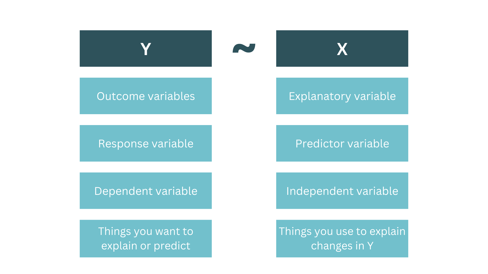
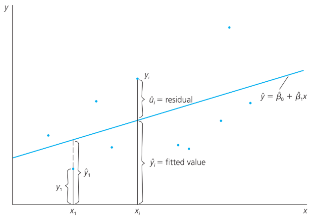

```{r}
#| echo: false
#| include: false
knitr::opts_chunk$set(
  comment = "",
  collapse = TRUE,
  fig.align = "center",
  fig.width = 8,
  fig.height = 7
)

## working directory
setwd(here::here("s5-regression-analysis"))

## Libraries
library(tidyverse)
library(glue)
library(patchwork)
library(kableExtra)
library(jtools)

# source R scripts
source("plot-source-code.R")


# setting the theme
theme_set(theme_bw(base_size = 18)) # Set theme for all ggplots
```

# Introduction to simple linear regression

## What is regression?

A way of predicting the value of one variable from another.

-   

    -   it is a hypothetical model of the relationship between two variables.
    -   the model used is linear.
    -   we describe the relationship using the equation of a straight line.

## Simple linear regression

```{r}
#| fig-align: center
#| fig-height: 5
#| fig-width: 10

# Parameters for the equation
a <- 2 # Intercept
b <- 3 # Slope

# Generate data for the line
x <- seq(-10, 10, by = 0.5)
y <- a + b * x
data <- data.frame(x = x, y = y)

# Generate random points around the line
set.seed(42) # For reproducibility
points <- data.frame(
  x = runif(30, min = -10, max = 10), # Random x-values
  y = a + b * runif(30, min = -10, max = 10) + rnorm(30, sd = 5) # Add noise to y
)

# Create plot
ggplot() +
  geom_line(data = data, aes(x = x, y = y), color = "blue", size = 1) + # Line for y = a + bx
  geom_point(data = points, aes(x = x, y = y), color = "red", size = 2) + # Random points
  annotate(
    "text",
    x = 5,
    y = 15,
    label = paste("y =", a, "+", b, "x"),
    color = "darkgreen",
    size = 5,
    hjust = 0
  ) +
  labs(
    caption = "Plot of y = a + bx with Scatter Points",
    x = "x",
    y = "y"
  ) +
  theme_minimal(base_size = 12) +
  theme(
    plot.caption = element_text(hjust = 0.5, margin = margin(t = 15), size = 14)
  )
```

## Simple linear regression (a quick review)

<br>

::: {.callout-note icon="false" style="font-size: 2.0em;"}
## Regression equation

$$
Y_i = \beta_0 + \beta_iX_i + \epsilon_i
$$

-   

    -   $\beta_i$
        -   regression coefficient for the predictor
        -   gradient or slope of the regression line
        -   direction/strength of the relationship
    -   $\beta_0$
        -   intercept
        -   point at which the regression line crosses the Y-axis
:::

## Simple linear regression (a quick review)

```{r}

```

## Deriving the Ordinary Least Squares (OLS) estimators

-   In order to estimate the regression model one needs data

-   A random sample of $n$ observations

    -   $(x_1, y_1)$ ← first observation
    -   $(x_2, y_2)$ ← second observation
    -   $(x_3, y_3)$ ← third observation
    -   ...
    -   $(x_n, y_n)$ ← nth observation

## Deriving the Ordinary Least Squares (OLS) estimators

-   Defining regression residuals
    -   $\hat{u_i} = y_i - \hat{y_i} = y_i - (\hat{\beta_0} + \hat{\beta_1}x_i)$

<br>

-   Minimize the sum of squared residuals (SSR)
    -   $\text{min} \Sigma_{i=1}^n \hat{u_i}^2$ → $\hat{\beta_0}, \hat{\beta_1}$

<br>

-   OLS estimator
    -   $\hat{\beta_1} = \frac{Cov(X,Y)}{Var(X)} = \frac{\Sigma_{i=1}^n (x_i - \bar{x})(y_i - \bar{y})}{\Sigma_{i=1}^n (x_i - \bar{x})^2}$
    -   $\hat{\beta_0} = \bar{y} - \hat{\beta_1}\bar{x}$

## Simple linear regression model

<br>

```{r}

```

::: aside
Source: Wooldridge, J. M. (2020). Introductory Econometrics: A Modern Approach (7th ed.). Cengage Learning.
:::

## Simple regression model

-   Wage and education
    -   $wage = \beta_0 + \beta_1 educ + u$
-   fitted regression
    -   $\hat{wage} = -0.90 + 0.54 educ$
    -   Interpretation: in the sample, one more year of education was associated with an increase in hourly wage by \$0.54.

```{r}
#| echo: true

# sample data
wage_dta <- wooldridge::wage1

# fitting the model
model <- lm(wage ~ educ, data = wage_dta)
broom::tidy(model)
```

## Simple linear regression

::: {.callout-tip style="font-size: 2.0em;"}
## Example in R

A distributor of frozen desert pies wants to evaluate the effect of price to the demand of pie. Data are collected for 15 weeks.
:::

```{r}
## import synthetic data
df <- tibble(
  Week = 1:15,
  Pie_Sales = c(
    350,
    460,
    350,
    430,
    350,
    380,
    430,
    470,
    450,
    490,
    340,
    300,
    440,
    450,
    300
  ),
  Price = c(
    5.50,
    7.50,
    8.00,
    8.00,
    6.80,
    7.50,
    4.50,
    6.40,
    7.00,
    5.00,
    7.20,
    7.90,
    5.90,
    5.00,
    7.00
  ),
  Advertising = c(
    3.3,
    3.3,
    3.0,
    4.5,
    3.0,
    4.0,
    3.0,
    3.7,
    3.5,
    4.0,
    3.5,
    3.2,
    4.0,
    3.5,
    2.7
  )
)
```

```{r}
#| echo: true

head(df)
```

## Simple linear regression

::::: columns
::: {.column width="40%"}
Step 1: check data using a scatter plot

```{r}
#| echo: true
#| eval: false

df |>
  ggplot(aes(Price, Pie_Sales)) +
  geom_point() +
  geom_smooth(method = "lm", se = FALSE) +
  scale_x_continuous(limits = c(4, 10)) +
  scale_y_continuous(limits = c(200, 500)) +
  theme_minimal(base_size = 14)
```
:::

::: {.column width="60%"}
```{r}
#| fig-align: center
#| fig-height: 6
#| fig-width: 8

df |>
  ggplot(aes(Price, Pie_Sales)) +
  geom_point(size = 2) +
  geom_smooth(method = "lm", se = FALSE) +
  scale_x_continuous(limits = c(4, 10)) +
  scale_y_continuous(limits = c(200, 500)) +
  theme_minimal(base_size = 14)
```
:::
:::::

## Simple linear regression

::::: columns
::: {.column width="50%"}
Step 2: Estimate the model

```{r}
#| echo: true

## estimating linear regression
model <- lm(Pie_Sales ~ Price, data = df)

## printing model summary
summary(model)
```
:::

::: {.column width="50%"}
Step 3: Interpret results

-   y-intercept (a): 558.28

    -   estimated average value of $y$ when all $x_i = 0$

-   slope (b): -24.03

    -   estimates the average value of y changes by $b_i$ units for each 1 unit increase in $x_i$ holding other variables constant.

    -   example: a 1 unit increase in price decreases the pie sales by 24.03 pies per week.
:::
:::::

## Multiple linear regression

-   

    -   a linear regression with one or more independent variable (explanatory variable), and one dependent variable (response variable).

    -   multiple regression model

$$
y = \beta_0 + \beta_1 x_1 + \beta_2 x_2 + ... + b_k x_k
$$

## Multiple linear regression

::: {.callout-note style="font-size: 2.0em;"}
## Example in R

A distributor of frozen desert pies wants to evaluate the factors affecting the demand of pie. Data are collected for 15 weeks.
:::

## Multiple linear regression

::::: columns
::: {.column width="30%"}
Step 1: import dataset

```{r}
#| echo: true

## import synthetic data
df <- tibble(
  Week = 1:15,
  Pie_Sales = c(
    350,
    460,
    350,
    430,
    350,
    380,
    430,
    470,
    450,
    490,
    340,
    300,
    440,
    450,
    300
  ),
  Price = c(
    5.50,
    7.50,
    8.00,
    8.00,
    6.80,
    7.50,
    4.50,
    6.40,
    7.00,
    5.00,
    7.20,
    7.90,
    5.90,
    5.00,
    7.00
  ),
  Advertising = c(
    3.3,
    3.3,
    3.0,
    4.5,
    3.0,
    4.0,
    3.0,
    3.7,
    3.5,
    4.0,
    3.5,
    3.2,
    4.0,
    3.5,
    2.7
  )
)

## print dataset
head(df)
```
:::

::: {.column width="70%"}
Step 2: Create a scatter plot

```{r}
#| fig-align: center
#| fig-height: 6
#| fig-width: 8

library(plotly)

fig <- plot_ly(
  df,
  x = ~Price,
  y = ~Advertising,
  z = ~Pie_Sales,
  type = "scatter3d",
  mode = "markers",
  marker = list(
    size = 5,
    color = ~Pie_Sales,
    colorscale = "Viridis",
    showscale = TRUE
  )
) %>%
  layout(
    title = "3D Scatter Plot: Pie Sales vs Price and Advertising",
    scene = list(
      xaxis = list(title = "Price"),
      yaxis = list(title = "Advertising"),
      zaxis = list(title = "Pie Sales")
    )
  )

# Display the plot
fig
```
:::
:::::

## Multiple linear regression

::::: columns
::: {.column width="50%"}
Step 3: Estimate the model

```{r}
#| echo: true

## estimating linear regression
model <- lm(Pie_Sales ~ Price + Advertising, data = df)

## printing model summary
summary(model)
```
:::

::: {.column width="50%"}
Step 4: Interpret results

-   $\beta_1$ (Price): -24.98

    -   pie sales will decrease, on average, by 24.98 pies per week for each 1 unit increase in selling price, net of the effects of changes due to advertising.

-   $\beta_2$ (Advertising): 74.13

    -   sales will increase, on average, by 74.13 pies per week for each \$1 increase in advertising, net of the effects of changes due to price.
:::
:::::

## Multiple linear regression

<br>

::::: columns
::: {.column width="30%"}
```{r}
#| echo: true
#| eval: false

# table summary
library(jtools)
summ(model)
```
:::

::: {.column width="70%"}
```{r}
# table summary
library(jtools)
summ(model)
```
:::
:::::

## Multiple linear regression

<br>

::::: columns
::: {.column width="40%"}
```{r}
#| echo: true
#| eval: false

# plot
library(jtools)
effect_plot(
  model,
  pred = Price,
  plot.points = TRUE,
  jitter = 0.5,
  interval = TRUE
)
```
:::

::: {.column width="60%"}
```{r}
#| fig-align: center

# plot
library(jtools)
effect_plot(
  model,
  pred = Price,
  plot.points = TRUE,
  jitter = 0.5,
  interval = TRUE
)
```
:::
:::::

## Multiple linear regression

<br>

::::: columns
::: {.column width="40%"}
```{r}
#| echo: true
#| eval: false

# plot
library(jtools)
effect_plot(
  model,
  pred = Advertising,
  plot.points = TRUE,
  jitter = 0.5,
  interval = TRUE
)
```
:::

::: {.column width="60%"}
```{r}
#| fig-align: center

# plot
library(jtools)
effect_plot(
  model,
  pred = Advertising,
  plot.points = TRUE,
  jitter = 0.5,
  interval = TRUE
)
```
:::
:::::

## Multiple linear regression

```{r}
library(visreg)

visreg(model, "Advertising", gg = TRUE)
```

```{r}
df |>
  ggplot(aes(Advertising, Pie_Sales)) +
  geom_point(size = 2) +
  geom_smooth(method = "lm", se = TRUE)
```

# Check-up quiz

## What is the primary goal of linear regression analysis? {.quiz-question}

-   To determine the strength of the relationship between two categorical variables.

-   [To predict the value of a dependent variable based on one or more independent variables]{.correct}

-   To compare the means of two or more groups.

-   To analyze the frequency of occurrences within categories.

## In simple linear regression, what does the slope of the regression line represent? {.quiz-question}

-   The average value of the dependent variable.

-   [The change in the dependent variable for a one-unit increase in the independent variable]{.correct}

-   The correlation between the two variables.

-   The predicted value of the dependent variable when the independent variable is zero.

## How does multiple linear regression differ from simple linear regression? {.quiz-question}

-   Multiple linear regression uses only one independent variable.

-   [Multiple linear regression uses two or more independent variables]{.correct}

-   Multiple linear regression analyzes categorical variables.

-   Multiple linear regression does not involve a dependent variable.

## What is the coefficient of determination (R-squared) in the context of regression analysis? {.quiz-question}

-   [A measure of the strength of the linear relationship between the variables]{.correct}

-   The probability of making a correct prediction.

-   The difference between the observed and predicted values.

-   he slope of the regression line.

## How good is the model?

<br>

::: {.callout-warning style="font-size: 2.0em;"}
## Take note!

-   

    -   The regression line is only a model based on a data.
    -   This model might not reflect the reality.
        -   We need some way of testing how well the model fits the observed data.
        -   how?
:::

## Sum of Squares

**Total sum of squares**

::::: columns
::: {.column width="40%"}
-   

    -   $SS_T = \Sigma(y_i - \bar{y})^2$
        -   uses the differences between the observed data and the mean value of Y
:::

::: {.column width="60%"}
```{r}
p_sst
```
:::
:::::

## Sum of Squares

**Residuals sum of squares**

::::: columns
::: {.column width="40%"}
-   

    -   $SS_R = \Sigma(y_i - \hat{y_i})^2$
        -   uses the differences between the observed data and regression line
:::

::: {.column width="60%"}
```{r}
p_ssr
```
:::
:::::

## Multiple coefficient of determination (R-squared)

::: {.callout-note style="font-size: 2.0em;"}
## R-squared ($R^2$)

-   

    -   reports the proportion of total variation of in $y$ explained by all $x$ variables taken together

$$
R^2 = \frac{\text{SSR}}{SST} = \frac{\text{Sum of squares regression}}{\text{Total sum of squares}}
$$
:::

## Multiple coefficient of determination (R-squared)

-   **Adjusted R-squared (**$R^2$)

    -   $R^2$ never decreases when new $x$ variable is added to the model.
    -   This can be disadvantage when comparing models

<br>

:::: fragment
::: {.callout-warning style="font-size: 2.0em;"}
## What is the effect of adding a new variable?

-   

    -   We lose a degree of freedom when a new $x$ variable is added.
    -   Did the new $x$ variable add enough explanatory power to offset the loss of one degree of freedom?
:::
::::

## Multiple coefficient of determination (R-squared)

::: {.callout-note style="font-size: 2.0em;"}
## **Adjusted R-squared (**$R^2$)

$$
R^2_{adj} = 1 - (1 - R^2)(\frac{n-1}{n-k-1})
$$

-   where
    -   $n$ = sample size
    -   $k$ = number of independent variables
:::

-   

    -   shows the proportion of variation in $y$ explained by all $x$ variables adjusted for the number of $x$ variables used.

    -   where excessive use of unimportant independent variables

    -   smaller then $R^2$

    -   useful in comparing among models

## Example in R

Calculate the $R^2$ and adjusted $R^2$

::::::: columns
:::: {.column width="50%"}
$$
R^2 = \frac{\text{SSR}}{SST} = \frac{\Sigma(y_i - \hat{y_i})^2}{\Sigma(y_i - \bar{y})^2}
$$

```{r}
#| echo: true

## Estimating linear regression
model <- lm(Pie_Sales ~ Price + Advertising, data = df)

## Extract model predictions
y_pred <- predict(model)
y_actual <- df$Pie_Sales

## Compute SS_tot (Total Sum of Squares)
y_mean <- mean(y_actual)
SS_tot <- sum((y_actual - y_mean)^2)

## Compute SS_res (Residual Sum of Squares)
SS_res <- sum((y_actual - y_pred)^2)

## Compute R-squared manually
r_squared_manual <- 1 - (SS_res / SS_tot)
```

::: {.callout-tip .mycallout appearance="simple" icon="false" style="font-size: 1.0em;"}
```{r}
## Print the manually calculated values
cat("Manual R-squared:", r_squared_manual, "\n")
```
:::
::::

:::: {.column width="50%"}
$$
R^2_{adj} = 1 - (1 - R^2)(\frac{n-1}{n-k-1})
$$

```{r}
#| echo: true

## Compute Adjusted R-squared manually
n <- nrow(df) # Number of observations
k <- length(coef(model)) - 1 # Number of predictors
adj_r_squared_manual <- 1 - ((1 - r_squared_manual) * (n - 1) / (n - k - 1))
```

::: {.callout-tip .mycallout appearance="simple" icon="false"}
```{r}
## Print the manually calculated values
cat("Manual Adjusted R-squared:", adj_r_squared_manual, "\n")
```
:::
::::
:::::::

# Diagnostic tests

## Linearity assumption

-   

    -   linear regression model relates the outcome to the predictors via a linear fashion.

    -   departure from linearity can be checked by using a scatter plot and a line overlaid to the plots

    -   if linearity is not satisfied, transformation may be needed

## Linearity assumption

**insert plot**

## Normality of errors

-   

    -   confidence intervals for regression and related hypothesis tests are based on the assumption that the coeffcient estimates have normal distribution.

## Homoscedasticity of error variance

## Independence of errors

## Non-multicollinearity

## 

# Thank you!