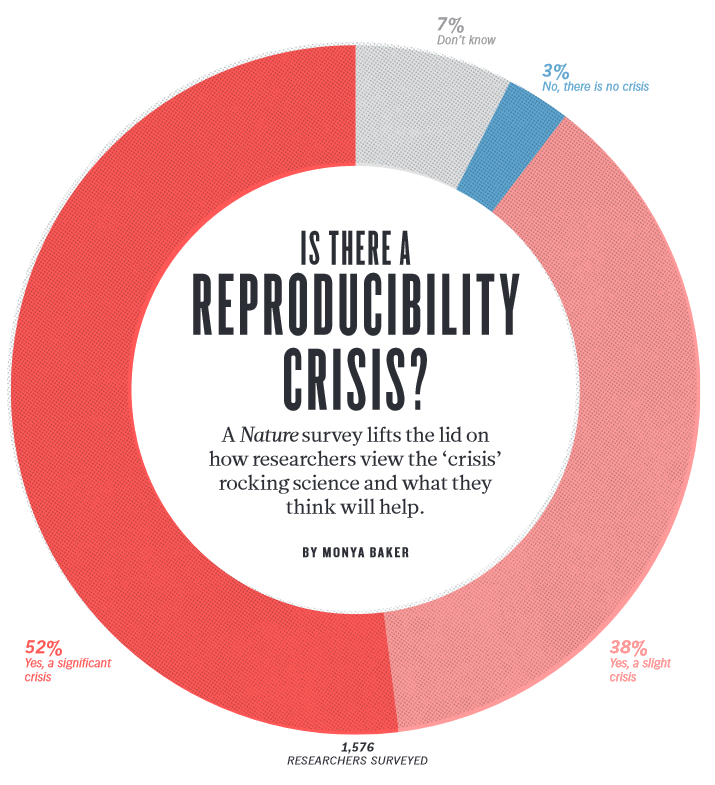
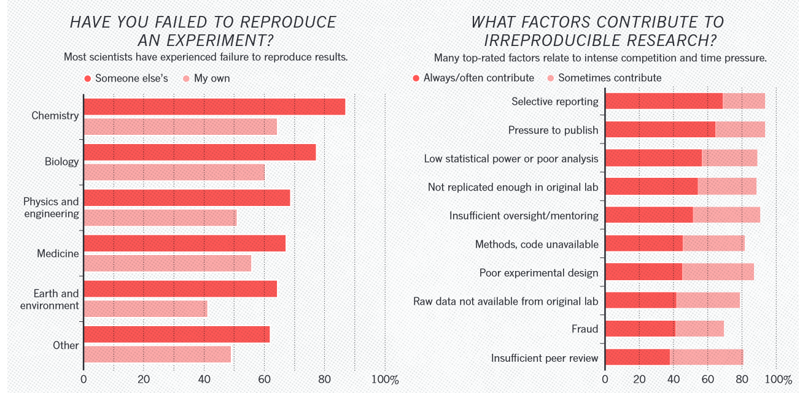
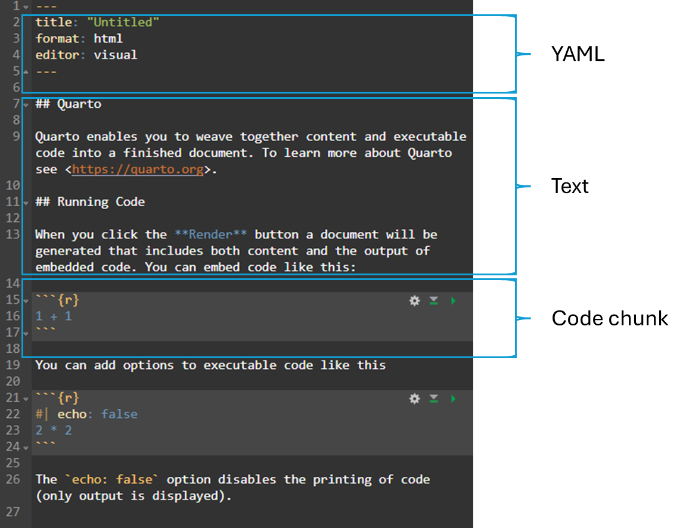
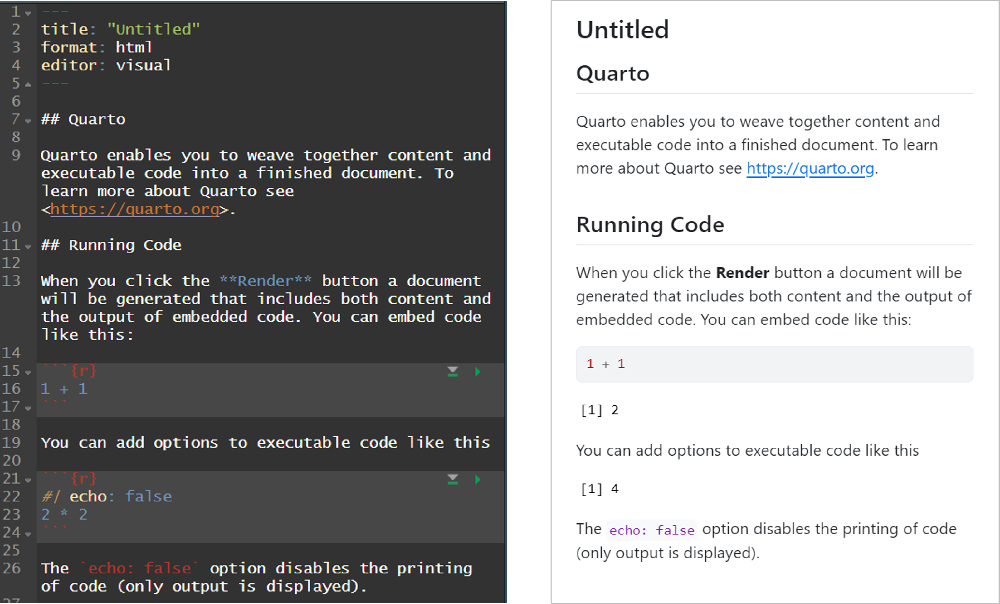
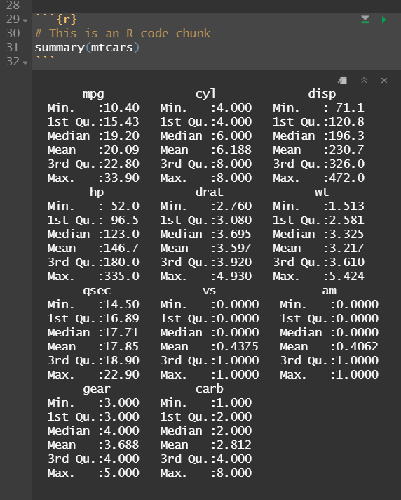
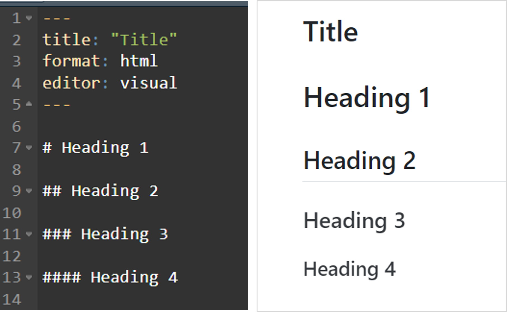

```{r}
#| echo: false
#| include: false
knitr::opts_chunk$set(comment = "", collapse = TRUE)

## working directory
setwd(here::here("s6-reproducible-report"))

## libraries
pacman::p_load(knitr, tidyverse, metathis)

## theme
theme_set(theme_minimal()) +
  theme(axis.title = element_text(size = 14))
```

## Outline

- Introduction to Quarto

- Quarto document elements

- Exercise: generating report

- Improving report

# Introduction to Quarto

## Reproducibility

<br>

::::: columns
::: column
### Reproducibility {.center-text}

- Obtaining computational results using the same input data, computational steps, methods, code and conditions of analysis.
:::

::: column
### Replicability {.center-text}

- Obtaining consistent results across studies aimed at answering the same scientific question, each of which has obtained its own data.
:::
:::::

<br>

::: {.source-text-smaller style="font-size: 0.7em;"}
[Source: National Academies of Sciences, Engineering, and Medicine. 2019. Reproducibility and Replicability in Science. Washington, DC: The National Academy Press, https://doi.org/10.17226/25303](https://doi.org/10.17226/25303)
:::

## What is reproducibility and replicability in research?

<br>

::::: columns
::: column
### Reproducibility {.center-text}

- same procedures

- same data

- same code
:::

::: column
### Replicability {.center-text}

- same procedures

- new data

- new code
:::
:::::

## 

{fig-align="center" width="40%" height="40%"}

::: {.source-text-smaller .center-text .smaller}
[Source: Baker, M. (2016). 1,500 scientists lift the lid on reproducibility. Nature, 533(7604), Article 7604. https://doi.org/10.1038/533452a](https://doi.org/10.1038/533452a)
:::

## 

{fig-align="center" width="105%" height="105%"}

::: {.source-text-smaller .center-text .smaller}
[Source: Baker, M. (2016). 1,500 scientists lift the lid on reproducibility. Nature, 533(7604), Article 7604. https://doi.org/10.1038/533452a](https://doi.org/10.1038/533452a)
:::

# Quarto document elements

## Quarto document elements

<br>

{fig-align="center" width="60%" height="60%"}

## Quarto document elements

#### Renderring or knitting file

{fig-align="center" width="80%" height="80%"}

## YAML

- YAML header

- Output types

- adding and formatting date

## YAML

#### Yet Another Markup Language

::::: columns
::: {.column width="50%"}
- refers to the metadata at the top of the document

- define the structure, appearance, and behavior

- enclosed by 3 dashes `---`
:::

::: {.column width="50%"}
``` r
---
title: "My Analysis Report"
author: "John Doe"
date: "2024-09-21"
format: html
editor: visual
---
```
:::
:::::

## YAML

#### Yet Another Markup Language

::::: columns
::: {.column width="50%"}
- `title`: title of the document

- `author`: author of the document

- `date`: date of the document

- `format`: output format

- `editor`: editor used to create the document
:::

::: {.column width="50%"}
``` r
---
title: "My Analysis Report"
author: "John Doe"
date: "2024-09-21"
format: html
editor: visual
---
```
:::
:::::

## Code chunk

- adding code chunk

- adding code comments

## Code chunk

::::: columns
::: {.column width="50%"}
- section of executable code embedded in the document

- enable to run code and display output

- enclosed by three back ticks and curly braces
:::

::: {.column width="50%"}
{fig-align="center" width="80%" height="\"80%"}
:::
:::::

## Text

- adding and formatting texts

- adding headers

- adding sentences

- inline code

- including links and images

## Text

::::: columns
::: {.column width="50%"}
- Quarto supports various fomatting elements to create rich content.

- Headers, paragraphs, lists, and inline code are some of the elements that can be used to create content.
:::

::: {.column width="50%" style="text-align: center;"}
:::
:::::

## Text

### Headers

{fig-align="center" width="60%" height="60%"}

## Text

### Bold and italics

``` r
This is **bold** and *italic* text.
```

This is **bold** and *italic* text.

## Text

### Lists

::::: columns
::: {.column width="50%"}
- Unordered lists: use `-` or `*` for bullet points.

- Ordered lists: use numbers followed by periods.
:::

::: {.column width="50%"}
``` r
- Item 1
- Item 2


1. First
2. Second
```

- Item 1

- Item 2

<br>

1.  First

2.  Second
:::
:::::

## Text

### Links and images

::::: columns
::: {.column width="50%"}
- `Links: [Link text](https://example.com)`

- `Images: `
:::

::: {.column width="50%"}
``` r
[Quarto website](https://quarto.org)


```

[Quarto website](https://quarto.org)

{fig-align="left" width="30%" height="30%"}
:::
:::::